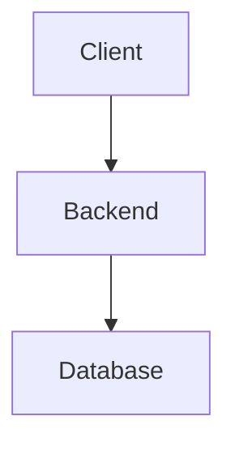

# **Cahier des Charges**

## **Site E-commerce de Compl'ements Alimentaires en Dropshipping**

**R'edig'e par :** Georges Dongmo  
**Date :** 8 juillet 2026  
**Version :** 1.0  
**Statut :** En validation  

---

## **```📋 Table des Mati```eres**

1. [Description du Projet](#-description-du-projet)
2. [Fonctionnalit'es](#-fonctionnalit'es)
3. [Conception de l```Architecture Backend](#-conception-de-larchitecture-backend)
4. [Choix de la Stack Technique](#-choix-de-la-stack-technique)
5. [Contraintes Techniques](#-contraintes-techniques)

---

---

## **```📌 Description du Projet```**

### **1.1 Contexte et Justification**

Le march'e des **compl'ements alimentaires** connait une croissance exponentielle en Afrique.

### **1.2 Objectifs du Projet**

D'evelopper une plateforme e-commerce moderne.

#### **Objectifs Sp'ecifiques**

| **Objectif** | **Indicateur de Succ```es** | **```Ech```eance** |
|--------------|--------------------------------|--------------|
| Lancer la plateforme | Site avec 50 produits | 3 mois |

---

### **1.3 P'erim```etre du Projet**

#### Inclus
- Site web responsive
- Int'egration avec 5 fournisseurs

#### Exclu
- Application mobile native

---

## **```🛠 Fonctionnalit```es**

### **2.1 Gestion du Catalogue**

| Fonctionnalit'e | Description | Technologie |
|------------------|-------------|-------------|
| Recherche avanc'ee | Filtres | Algolia |

---

## **```🏗️ Conception de l```Architecture Backend**

### **3.1 Choix de l```Architecture**

**Architecture Retenue : Serverless + Modulaire**

---

#### **Diagramme Mermaid**



---

## **```💻 Choix de la Stack Technique```**

### **4.1 Langage**
**TypeScript**

### **4.2 Framework**
- Frontend: Next.js
- Backend: Supabase

### **4.3 Base de Donn'ees**
**Supabase (PostgreSQL)**

---

## **Contraintes Techniques**

| Contrainte | Exigence | Solution |
|------------|----------|----------|
| Performance | < 2s | Next.js + CDN |